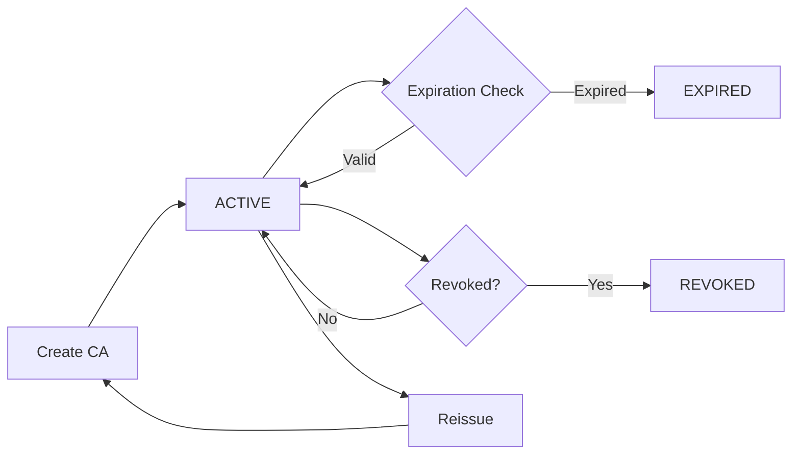

# Certificate Authorities

Certificate Authorities (CAs) are the foundation of Lamassu's PKI infrastructure. They issue, sign, and manage digital certificates that establish device identities and secure communications.

## CA Lifecycle

A Certificate Authority in Lamassu follows a well-defined lifecycle from creation to expiration or revocation:



### CA Status States

Lamassu tracks CAs through several status states:

- **ACTIVE** — CA is valid and can issue certificates
- **EXPIRED** — CA certificate has passed its validity period
- **REVOKED** — CA has been revoked and should not be trusted
- **INACTIVE** — CA is not currently in use

<Info>
  CA status is automatically computed based on certificate validity periods and revocation status.
</Info>

## CA Certificate Types

Lamassu supports three types of CA certificates:

### Managed CAs

**Type**: `MANAGED`

Managed CAs are created and controlled entirely by Lamassu. The platform generates the private key, stores it securely in a crypto engine, and manages the full certificate lifecycle.

<Note>
  Managed CAs provide the highest level of automation and integration with Lamassu's key management system.
</Note>

**Use cases**:
- Production PKI hierarchies
- Automated certificate issuance
- Hardware-backed key storage (PKCS#11, AWS KMS)

### Imported with Key

**Type**: `IMPORTED_WITH_KEY`

CAs imported along with their private keys. Lamassu stores both the certificate and private key, enabling the CA to issue certificates.

**Use cases**:
- Migrating existing PKI infrastructure
- Using externally generated CA keys
- Integration with external certificate workflows

### Imported without Key

**Type**: `IMPORTED_WITHOUT_KEY`

CAs imported for trust and validation purposes only. Lamassu stores the certificate but not the private key, so the CA cannot issue new certificates through Lamassu.

**Use cases**:
- Adding external trust anchors
- Certificate validation and chain building
- CA distribution for EST endpoints

## CA Hierarchy and Levels

Lamassu supports multi-level CA hierarchies for implementing enterprise PKI best practices:

```
Root CA (Level 0)
└── Intermediate CA 1 (Level 1)
    ├── Issuing CA 1a (Level 2)
    └── Issuing CA 1b (Level 2)
└── Intermediate CA 2 (Level 1)
    └── Issuing CA 2a (Level 2)
```

### CA Level Metadata

Each CA certificate includes level metadata:

- **Level** — Position in the hierarchy (0 = root, 1 = intermediate, 2+ = issuing)
- **Issuer CA Metadata** — Reference to the parent CA
  - Serial Number
  - CA ID
  - Level

<Tip>
  Use separate issuing CAs for different purposes (device certificates, server certificates, etc.) to limit the blast radius of a compromise.
</Tip>

## CA Data Model

The core CA data structure:

```go
type CACertificate struct {
    ID                      string                 // Unique CA identifier
    Certificate             Certificate            // The CA certificate
    CertificateSerialNumber string                 // Serial number reference
    Metadata                map[string]interface{} // Custom metadata
    CreationTS              time.Time              // Creation timestamp
    Level                   int                    // Hierarchy level
    ProfileID               string                 // Associated issuance profile
}
```

Key fields:

- **ID** — Unique identifier for the CA (e.g., `ca-root-01`)
- **Certificate** — Full certificate object including X.509 details
- **Level** — Position in the CA hierarchy
- **ProfileID** — Default issuance profile for certificates issued by this CA
- **Metadata** — Flexible key-value storage for custom attributes

## Certificate Subject and Issuer

Every CA certificate contains subject and issuer information:

```go
type Subject struct {
    CommonName       string // CN
    Organization     string // O
    OrganizationUnit string // OU
    Country          string // C
    State            string // ST
    Locality         string // L
}
```

<Note>
  For root CAs, the subject and issuer are identical (self-signed). For subordinate CAs, the issuer matches the parent CA's subject.
</Note>

## CA Reissuance

Lamassu supports CA reissuance for certificate renewal or rotation:

### Reissuance Metadata

CA metadata tracks reissuance operations:

- `lamassu.io/ca/reissued-as` — ID of the new CA certificate
- `lamassu.io/ca/reissued-at` — Timestamp of reissuance
- `lamassu.io/ca/reissued-from` — ID of the original CA certificate
- `lamassu.io/ca/reissue-reason` — Reason for reissuance

### Reissuance Workflow

1. **Generate new key pair** (optional — can reuse existing key)
2. **Create CSR** with updated validity period
3. **Sign with parent CA** or self-sign for root
4. **Update metadata** on both old and new CA
5. **Transition clients** to trust new CA

<Warning>
  Plan CA reissuance well before expiration. Devices need time to update their trust stores.
</Warning>

## Expiration Monitoring

Lamassu provides built-in CA expiration monitoring:

### Monitoring Deltas

Configure expiration alerts using monitoring deltas:

```go
type MonitoringExpirationDelta struct {
    Delta     TimeDuration // Time before expiration
    Name      string       // Alert name
    Triggered bool         // Whether alert has fired
}
```

Stored in CA metadata:
- Key: `lamassu.io/ca/expiration-deltas`
- Value: Array of `MonitoringExpirationDelta` objects

### Example Configuration

```json
{
  "metadata": {
    "lamassu.io/ca/expiration-deltas": [
      {
        "delta": "90d",
        "name": "CA_EXPIRING_90_DAYS",
        "triggered": false
      },
      {
        "delta": "30d",
        "name": "CA_EXPIRING_30_DAYS",
        "triggered": false
      }
    ]
  }
}
```

<Tip>
  Set multiple expiration deltas (90d, 60d, 30d, 7d) for progressive alerting as CA expiration approaches.
</Tip>

## CA Statistics

Lamassu provides aggregated statistics for CA monitoring:

```go
type CAStats struct {
    CACertificatesStats CACertificatesStats
    CertificatesStats   CertificatesStats
}

type CACertificatesStats struct {
    TotalCAs                 int                       // Total CA count
    CAsDistributionPerEngine map[string]int            // CAs by crypto engine
    CAsStatus                map[CertificateStatus]int // CAs by status
}

type CertificatesStats struct {
    TotalCertificates            int                       // Total certificates
    CertificateDistributionPerCA map[string]int            // Certificates by CA
    CertificateStatus            map[CertificateStatus]int // Certificates by status
}
```

## Crypto Engine Binding

Each CA is bound to a crypto engine that stores its private key:

- **EngineID** — Identifier of the crypto engine (e.g., `golang-default`, `aws-kms-prod`)
- **Engine Type** — PKCS11, AWS KMS, Azure Key Vault, HashiCorp Vault, or Golang (software)
- **Security Level** — SL0 (software), SL1 (cloud HSM), SL2 (hardware HSM)

<Info>
  See [Key Management](/concepts/key-management) for details on crypto engines and security levels.
</Info>

## Issuance Profiles

CAs can have associated issuance profiles that define:

- Certificate validity periods
- Key usage and extended key usage
- Subject DN handling
- Crypto enforcement policies

**Profile ID** — Reference to the default issuance profile for this CA

Issuance profiles enable policy-based certificate issuance and ensure consistency across certificates issued by the same CA.

<Tip>
  Use different issuance profiles for device certificates vs. server certificates to enforce appropriate key usage and validity periods.
</Tip>

## Related API Endpoints

- `GET /v2/cas` — List all CAs with filtering
- `POST /v2/cas` — Create a new CA
- `GET /v2/cas/{caId}` — Get CA details
- `DELETE /v2/cas/{caId}` — Revoke or delete a CA
- `GET /v2/cas/{caId}/certificates` — List certificates issued by a CA
- `GET /v2/stats/cas` — Get CA statistics

See [Certificate Authority API](/api/ca/overview) for complete API documentation.

## Best Practices

### Root CA Protection

- Store root CA keys offline or in hardware HSMs (SL2)
- Limit root CA certificate validity to 10-20 years
- Use root CAs only to sign intermediate CAs, not end-entity certificates
- Maintain offline backups of root CA private keys

### Intermediate CAs

- Use intermediate CAs for day-to-day certificate issuance
- Set intermediate CA validity to 5-10 years
- Rotate intermediate CAs before expiration
- Distribute intermediate CA certificates with end-entity certificates

### Operational CAs

- Create separate CAs for different certificate types (devices, servers, users)
- Set operational CA validity to 2-5 years
- Enable expiration monitoring with appropriate deltas
- Plan reissuance strategy before CA expiration

### Metadata Usage

- Tag CAs with environment labels (production, staging, development)
- Track CA purpose in metadata (devices, servers, code signing)
- Document CA ownership and operational contacts
- Store compliance and audit information in metadata

## Next Steps

<CardGroup cols={2}>
  <Card title="Device Management" icon="microchip" href="/concepts/device-management">
    Learn how devices use CA certificates for identity
  </Card>
  <Card title="Enrollment" icon="shield-check" href="/concepts/enrollment">
    Understand device enrollment and certificate provisioning
  </Card>
  <Card title="Managing CAs" icon="building-shield" href="/guides/managing-cas">
    Practical guide to creating and managing CAs
  </Card>
  <Card title="Issuance Profiles" icon="file-certificate" href="/guides/issuance-profiles">
    Configure certificate issuance policies
  </Card>
</CardGroup>
