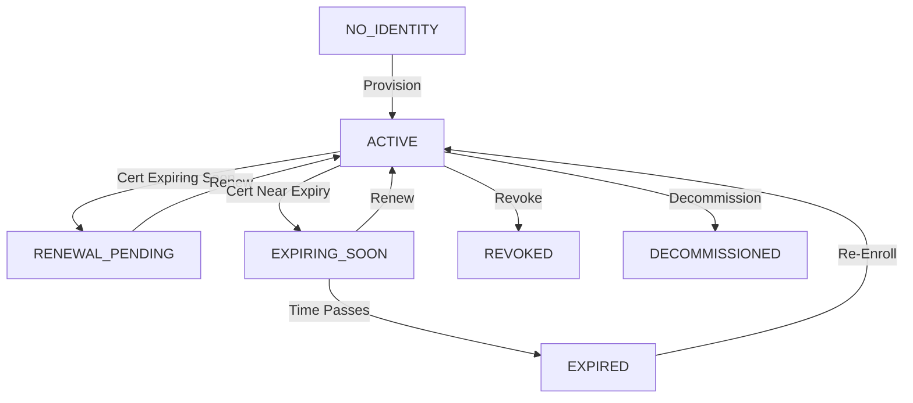

# Device Management

Lamassu's Device Manager service provides comprehensive device lifecycle management, tracking device identities, certificate bindings, and operational status for IoT deployments at scale.

## Device Identity Model

Devices in Lamassu are identified by unique IDs and maintain their cryptographic identity through certificate slots:

```go
type Device struct {
    ID                string                    // Unique device identifier
    Tags              []string                  // Classification tags
    Status            DeviceStatus              // Current device status
    Icon              string                    // Visual icon identifier
    IconColor         string                    // Icon color code
    CreationTimestamp time.Time                 // Device registration time
    Metadata          map[string]any            // Custom metadata
    DMSOwner          string                    // DMS that manages this device
    IdentitySlot      *Slot[string]             // Primary identity certificate
    ExtraSlots        map[string]*Slot[any]     // Additional certificate slots
    Events            map[time.Time]DeviceEvent // Device lifecycle events
}
```

### Core Device Properties

- **ID** — Globally unique device identifier (e.g., `device-001`, UUID, serial number)
- **Tags** — Flexible labels for device classification and grouping
- **Status** — Current operational status (see Device Lifecycle States below)
- **Metadata** — Key-value map for custom attributes and integration data
- **DMSOwner** — ID of the DMS (Device Management Service) responsible for this device
- **CreationTimestamp** — When the device was first registered in Lamassu

<Info>
  Device IDs should be stable, globally unique identifiers. Common choices include hardware serial numbers, UUIDs, or MAC addresses.
</Info>

## Device Lifecycle States

Devices transition through several states during their operational lifetime:



### Status Definitions

#### NO_IDENTITY
Device is registered but has no identity certificate. This is the initial state after device registration.

**Actions**: Provision the device through EST enrollment or manual certificate binding

#### ACTIVE
Device has a valid identity certificate and is fully operational.

**Characteristics**:
- Identity certificate is within validity period
- Certificate is not revoked
- Device can authenticate to services

#### RENEWAL_PENDING
Device certificate has entered the preventive renewal window (typically 60-90 days before expiration).

**Actions**: Device should re-enroll to obtain a new certificate before the current one expires

<Tip>
  Configure the preventive renewal window in the DMS settings to ensure devices renew certificates well before expiration.
</Tip>

#### EXPIRING_SOON
Device certificate has entered the critical renewal window (typically 7-30 days before expiration).

**Actions**: Immediate re-enrollment required. Generate alerts and notifications.

<Warning>
  Devices in EXPIRING_SOON state are at risk of losing connectivity. Prioritize certificate renewal.
</Warning>

#### EXPIRED
Device certificate has passed its expiration date.

**Actions**: 
- Device cannot authenticate with expired certificate
- Re-enrollment required (may need special handling if DMS doesn't allow expired renewal)
- Consider device recovery procedures

#### REVOKED
Device certificate has been revoked.

**Reasons for revocation**:
- Device compromise suspected
- Device decommissioned
- Certificate mis-issuance
- Key compromise

**Actions**: Device must obtain a new certificate through re-provisioning

#### DECOMMISSIONED
Device has been permanently retired from service.

**Characteristics**:
- Certificate is revoked
- Device should not re-enroll
- Historical data is retained for audit purposes

## Certificate Slots

Lamassu uses a slot-based architecture to manage device certificates and cryptographic secrets:

```go
type Slot[E any] struct {
    Status         SlotStatus                // Slot status
    ActiveVersion  int                       // Currently active version
    SecretType     CryptoSecretType          // Type of secret
    Secrets        map[int]E                 // Version -> secret mapping
    ExpirationDate *time.Time                // Next expiration
    Events         map[time.Time]DeviceEvent // Slot lifecycle events
}
```

### Identity Slot

The **IdentitySlot** is the primary certificate slot that establishes device identity:

- **Type**: `Slot[string]`
- **Contains**: Certificate serial numbers (strings)
- **Purpose**: Device authentication and identity
- **Required**: Yes (device has NO_IDENTITY status without it)

### Extra Slots

Devices can have additional certificate slots for specific purposes:

- **Type**: `map[string]*Slot[any]`
- **Use cases**:
  - TLS client certificates
  - TLS server certificates (for edge gateways)
  - Code signing certificates
  - Encryption certificates
  - Application-specific certificates

<Note>
  Extra slots enable devices to hold multiple certificates for different purposes, managed independently with separate lifecycles.
</Note>

### Slot Status States

Each slot maintains its own status:

- **ACTIVE** — Certificate is valid and in use
- **RENEWAL_PENDING** — In preventive renewal window
- **EXPIRING_SOON** — In critical renewal window
- **EXPIRED** — Certificate has expired
- **REVOKED** — Certificate has been revoked

### Secret Types

Slots can contain different types of cryptographic secrets:

```go
type CryptoSecretType string

const (
    TokenSlotProfile      CryptoSecretType = "TOKEN"
    X509SlotProfileType   CryptoSecretType = "x509"
    SshKeySlotProfileType CryptoSecretType = "SSH_KEY"
    OtherSlotProfileType  CryptoSecretType = "OTHER"
)
```

- **x509** — X.509 certificates (most common)
- **SSH_KEY** — SSH public keys
- **TOKEN** — Authentication tokens
- **OTHER** — Custom secret types

### Versioned Secrets

Slots maintain multiple versions of secrets:

```json
{
  "active_version": 2,
  "secrets": {
    "1": "serial-number-001",
    "2": "serial-number-002"
  }
}
```

**Benefits**:
- Graceful certificate rotation
- Rollback capability
- Historical tracking
- Overlap periods during renewal

<Tip>
  During certificate renewal, the old certificate remains in the slot until the new one is successfully provisioned and activated.
</Tip>

## Device Events

Lamassu tracks device lifecycle events for audit and troubleshooting:

```go
type DeviceEvent struct {
    EvenType          DeviceEventType // Event type
    EventDescriptions string          // Human-readable description
}

type DeviceEventType string

const (
    DeviceEventTypeCreated              DeviceEventType = "CREATED"
    DeviceEventTypeProvisioned          DeviceEventType = "PROVISIONED"
    DeviceEventTypeReProvisioned        DeviceEventType = "RE-PROVISIONED"
    DeviceEventTypeRenewed              DeviceEventType = "RENEWED"
    DeviceEventTypeShadowUpdated        DeviceEventType = "SHADOW-UPDATED"
    DeviceEventTypeStatusUpdated        DeviceEventType = "STATUS-UPDATED"
    DeviceEventTypeStatusDecommissioned DeviceEventType = "DECOMMISSIONED"
)
```

### Event Types

#### CREATED
Device was registered in the system.

**Trigger**: Device created via API or pre-registration

#### PROVISIONED
Device received its first identity certificate.

**Trigger**: Successful EST enrollment or certificate binding

#### RE-PROVISIONED
Device identity certificate was replaced (not renewed).

**Trigger**: Certificate replacement with different key pair

#### RENEWED
Device certificate was renewed.

**Trigger**: EST re-enrollment or manual renewal

#### SHADOW-UPDATED
Device metadata or configuration was updated.

**Trigger**: API update to device properties

#### STATUS-UPDATED
Device status changed.

**Trigger**: Automatic status computation or manual status change

#### DECOMMISSIONED
Device was decommissioned.

**Trigger**: Device decommissioning operation

<Info>
  Events are stored with timestamps, enabling complete audit trails and operational visibility.
</Info>

## Device Groups

Lamassu supports dynamic device grouping based on filter criteria:

```go
type DeviceGroup struct {
    ID          string                    // Group identifier
    Name        string                    // Display name
    Description string                    // Description
    ParentID    *string                   // Parent group (hierarchical)
    Criteria    []DeviceGroupFilterOption // Filter criteria
    CreatedAt   time.Time
    UpdatedAt   time.Time
}

type DeviceGroupFilterOption struct {
    Field           string // Device field to filter
    FilterOperation int    // Filter operation (equals, contains, etc.)
    Value           string // Filter value
}
```

### Use Cases

- **Organizational grouping** — By department, location, or business unit
- **Functional grouping** — By device type, firmware version, or capability
- **Operational grouping** — By status, certificate expiration, or health
- **Policy application** — Apply policies to groups rather than individual devices

### Hierarchical Groups

Device groups can be nested using the `ParentID` field:

```
All Devices
├── Production
│   ├── Region-US
│   └── Region-EU
└── Development
    └── Test Lab
```

<Tip>
  Use hierarchical groups to model your organizational structure and inherit policies from parent groups.
</Tip>

## DMS Ownership

Each device is owned by a Device Management Service (DMS):

- **DMSOwner** field stores the DMS ID
- DMS controls enrollment policies and settings
- DMS determines which CA issues device certificates
- DMS manages re-enrollment and renewal policies

### DMS Attachment Metadata

CA certificates can be attached to devices with authorization tracking:

```go
type CAAttachedToDevice struct {
    AuthorizedBy struct {
        RAID string // Registration Authority ID
    }
    DeviceID string // Device identifier
}
```

Stored in CA metadata:
- Key: `lamassu.io/ra/attached-to`
- Value: `CAAttachedToDevice` object

## Device Statistics

Lamassu provides aggregated device statistics:

```go
type DevicesStats struct {
    TotalDevices  int                  // Total device count
    DevicesStatus map[DeviceStatus]int // Devices by status
}
```

**Example response**:
```json
{
  "total": 10000,
  "status_distribution": {
    "ACTIVE": 8500,
    "RENEWAL_PENDING": 800,
    "EXPIRING_SOON": 500,
    "EXPIRED": 150,
    "REVOKED": 30,
    "DECOMMISSIONED": 20
  }
}
```

<Info>
  Use statistics endpoints to monitor fleet health and identify devices requiring attention.
</Info>

## Device Metadata

The flexible metadata field supports custom device attributes:

```json
{
  "metadata": {
    "hardware_version": "v2.1",
    "firmware_version": "1.4.2",
    "location": "Building-A/Floor-3/Room-301",
    "owner": "manufacturing@example.com",
    "deployment_date": "2024-03-15",
    "custom_id": "ASSET-12345"
  }
}
```

### Common Metadata Fields

- **Hardware information** — Model, version, capabilities
- **Software versions** — Firmware, OS, application versions
- **Location** — Physical or logical location
- **Ownership** — Team, department, or individual owner
- **Deployment** — Deployment date, environment, purpose
- **Integration IDs** — External system identifiers

<Tip>
  Use consistent metadata schemas across your fleet to enable effective filtering and reporting.
</Tip>

## Related API Endpoints

- `GET /v2/devices` — List devices with filtering
- `POST /v2/devices` — Register a new device
- `GET /v2/devices/{deviceId}` — Get device details
- `PATCH /v2/devices/{deviceId}` — Update device metadata
- `DELETE /v2/devices/{deviceId}` — Decommission a device
- `GET /v2/devices/{deviceId}/events` — Get device event history
- `GET /v2/stats/devices` — Get device statistics
- `GET /v2/device-groups` — List device groups
- `POST /v2/device-groups` — Create device group

See [Device Manager API](/api/device-manager/overview) for complete API documentation.

## Best Practices

### Device Registration

- **Pre-register devices** when possible for tighter security control
- **Use stable identifiers** that don't change across device lifecycle
- **Populate metadata** at registration time for better tracking
- **Apply tags** for classification and grouping

### Certificate Management

- **Monitor renewal windows** and alert on EXPIRING_SOON status
- **Automate re-enrollment** using EST protocol
- **Plan for failures** — handle devices that miss renewal windows
- **Track versions** — maintain certificate history in slots

### Operational Monitoring

- **Track status distribution** to identify fleet health trends
- **Alert on status changes** especially to EXPIRED or REVOKED
- **Review event logs** for troubleshooting and compliance
- **Use device groups** for bulk operations and policy application

### Metadata Strategy

- **Define metadata schema** for your organization
- **Enforce required fields** through automation or workflows
- **Index important fields** for filtering and search
- **Version metadata** for historical tracking

### Decommissioning

- **Revoke certificates** before decommissioning
- **Document reason** in events or metadata
- **Retain audit data** per compliance requirements
- **Update external systems** that reference the device

## Integration Points

### Cloud Connectors

Device data can be synchronized with cloud platforms:

- **AWS IoT** — Sync device registry with AWS IoT Core
- **Azure IoT Hub** — Integration via custom connectors
- **Custom platforms** — Use webhooks and events

See [AWS IoT Connector](/connectors/aws-iot) for details.

### Event Bus

Device events are published to the event bus:

- Subscribe to device lifecycle events
- Trigger workflows on status changes
- Integrate with monitoring and alerting systems

See [Event Bus](/engines/event-bus) for configuration.

## Next Steps

<CardGroup cols={2}>
  <Card title="Enrollment" icon="shield-check" href="/concepts/enrollment">
    Learn how devices obtain certificates through EST
  </Card>
  <Card title="Certificate Authorities" icon="certificate" href="/concepts/certificate-authorities">
    Understand CA management and certificate issuance
  </Card>
  <Card title="Device Lifecycle Guide" icon="arrows-rotate" href="/guides/device-lifecycle">
    Practical guide to managing device lifecycles
  </Card>
  <Card title="EST Enrollment Guide" icon="mobile" href="/guides/est-enrollment">
    Set up automated device enrollment
  </Card>
</CardGroup>
