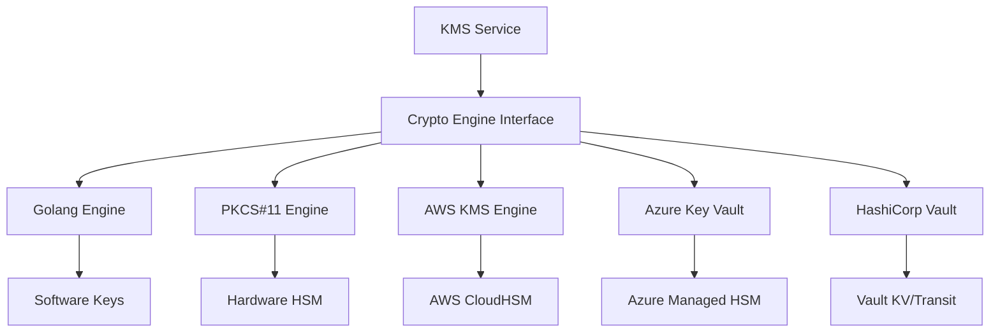

# Key Management

Lamassu's Key Management Service (KMS) provides cryptographic key lifecycle management through pluggable crypto engines, supporting software-based keys, cloud HSMs, and hardware security modules.

## Architecture Overview

The KMS architecture separates key management logic from cryptographic operations:



### Pluggable Crypto Engines

Crypto engines implement the cryptographic operations interface while providing different storage and security guarantees.

<Info>
  All crypto engines expose the same API, allowing seamless switching between implementations based on security requirements and deployment environment.
</Info>

## Crypto Engine Types

Lamassu supports five crypto engine types:

```go
type CryptoEngineType string

const (
    PKCS11            CryptoEngineType = "PKCS11"
    AzureKeyVault     CryptoEngineType = "AZURE_KEY_VAULT"
    Golang            CryptoEngineType = "GOLANG"
    VaultKV2          CryptoEngineType = "HASHICORP_VAULT_KV_V2"
    AWSKMS            CryptoEngineType = "AWS_KMS"
    AWSSecretsManager CryptoEngineType = "AWS_SECRETS_MANAGER"
)
```

### Golang (Software)

**Type**: `GOLANG`  
**Security Level**: SL0 (Software)

**Characteristics**:
- Pure Go implementation using standard crypto libraries
- Keys stored in software (database or file system)
- No external dependencies
- Fast cryptographic operations

**Use cases**:
- Development and testing
- Non-production environments
- Low-security requirements
- Air-gapped deployments without HSM access

<Warning>
  Software keys (SL0) should not be used for production CA private keys. Use hardware-backed storage (SL1 or SL2) for production CAs.
</Warning>

### PKCS#11

**Type**: `PKCS11`  
**Security Level**: SL2 (Hardware HSM)

**Characteristics**:
- Industry standard interface (PKCS#11)
- Keys stored in hardware security modules
- FIPS 140-2 Level 2/3 compliance (depends on HSM)
- Tamper-resistant key storage

**Supported HSMs**:
- Thales Luna HSM
- Gemalto SafeNet HSM
- Utimaco HSM
- SoftHSM (software HSM for testing)
- nCipher nShield

**Use cases**:
- Production root and intermediate CAs
- High-security deployments
- Compliance requirements (PCI-DSS, FIPS)
- On-premises infrastructure

<Tip>
  Use PKCS#11 engines with hardware HSMs for the highest level of key protection. Configure redundant HSMs for high availability.
</Tip>

### AWS KMS

**Type**: `AWS_KMS`  
**Security Level**: SL1 (Cloud HSM)

**Characteristics**:
- Managed service by AWS
- Keys stored in AWS CloudHSM clusters
- FIPS 140-2 Level 3 validated
- Integrated IAM access control
- Multi-region key replication

**Use cases**:
- AWS-native deployments
- Cloud-first architectures
- Multi-region PKI
- Managed HSM without hardware procurement

**Configuration**:
- AWS region
- IAM credentials or instance profile
- Optional KMS key aliases

### AWS Secrets Manager

**Type**: `AWS_SECRETS_MANAGER`  
**Security Level**: SL0 (Software)

**Characteristics**:
- Managed secret storage by AWS
- Keys stored encrypted at rest
- Automatic rotation support
- IAM access control
- Versioning and audit logging

**Use cases**:
- Non-CA keys (device keys, application keys)
- Development and testing in AWS
- Key storage without HSM requirements

<Note>
  AWS Secrets Manager provides software-level security (SL0) despite being a managed service. Use AWS KMS for hardware-backed key protection.
</Note>

### Azure Key Vault

**Type**: `AZURE_KEY_VAULT`  
**Security Level**: SL1 (Cloud HSM)

**Characteristics**:
- Managed service by Microsoft Azure
- HSM-backed key storage (Premium tier)
- FIPS 140-2 Level 2 validated
- Azure AD access control
- Multi-region replication

**Use cases**:
- Azure-native deployments
- Multi-cloud with Azure presence
- Managed HSM in Azure

**Configuration**:
- Azure subscription and resource group
- Key Vault name
- Azure AD service principal credentials

### HashiCorp Vault KV v2

**Type**: `HASHICORP_VAULT_KV_V2`  
**Security Level**: SL0 (Software) or SL1 (if Vault uses HSM backend)

**Characteristics**:
- Self-hosted or HCP Vault
- Versioned secret storage
- Policy-based access control
- Audit logging
- Can be backed by HSM (Auto Unseal)

**Use cases**:
- Multi-cloud deployments
- Organizations already using Vault
- Advanced policy and RBAC requirements
- Hybrid cloud/on-premises

**Configuration**:
- Vault address
- Authentication method (token, AppRole, Kubernetes)
- KV v2 mount path

## Security Levels

Crypto engines are classified by security level:

```go
type CryptoEngineSL int

const (
    SL0 CryptoEngineSL = 0 // Software
    SL1 CryptoEngineSL = 1 // Cloud HSM
    SL2 CryptoEngineSL = 2 // Hardware HSM
)
```

### SL0 — Software

**Protection level**: Software-based encryption

**Engines**: Golang, AWS Secrets Manager, Vault KV v2 (without HSM backend)

**Guarantees**:
- Keys encrypted at rest
- Access control via application layer
- No hardware tamper protection

**Appropriate for**:
- Device private keys (ephemeral)
- Application keys
- Development and testing

### SL1 — Cloud HSM

**Protection level**: Cloud-managed HSM

**Engines**: AWS KMS, Azure Key Vault (Premium)

**Guarantees**:
- Keys stored in FIPS 140-2 validated HSMs
- Keys never leave HSM in plaintext
- Cloud provider manages HSM infrastructure

**Appropriate for**:
- Production intermediate and issuing CAs
- Cloud-native deployments
- Managed security without hardware procurement

### SL2 — Hardware HSM

**Protection level**: On-premises HSM

**Engines**: PKCS#11

**Guarantees**:
- Keys stored in organization-controlled HSMs
- FIPS 140-2 Level 2/3 compliance
- Physical tamper protection
- Complete control over key lifecycle

**Appropriate for**:
- Root CAs
- High-security compliance requirements
- Air-gapped environments
- Maximum control and sovereignty

<Info>
  Choose security level based on the criticality of the keys and compliance requirements. Root CAs should always use SL2, while device keys can use SL0.
</Info>

## Key Data Model

```go
type Key struct {
    PKCS11URI     string         // PKCS#11 URI (computed)
    KeyID         string         // Unique key identifier
    Name          string         // Human-readable name
    Aliases       []string       // Alternative names
    EngineID      string         // Crypto engine ID
    HasPrivateKey bool           // Private key availability
    Algorithm     string         // Key algorithm (RSA, ECDSA, Ed25519)
    Size          int            // Key size in bits
    PublicKey     string         // PEM-encoded public key
    CreationTS    time.Time      // Creation timestamp
    Tags          []string       // Classification tags
    Metadata      map[string]any // Custom metadata
}
```

### Key Fields

#### KeyID
Unique identifier for the key within the crypto engine.

**Examples**:
- `key-ca-root-01`
- `device-key-12345`
- UUID

#### Name and Aliases
**Name**: Primary human-readable identifier  
**Aliases**: Alternative names for key lookup

**Use case**: Alias `ca-root` might point to `key-ca-root-01-v2` after rotation

#### EngineID
Identifier of the crypto engine storing this key.

**Examples**:
- `golang-default`
- `pkcs11-prod-hsm`
- `aws-kms-us-east-1`

#### Algorithm and Size
**Algorithm**: Cryptographic algorithm
- `RSA`
- `ECDSA`
- `Ed25519`
- `DSA` (legacy)

**Size**: Key size in bits
- RSA: 2048, 3072, 4096
- ECDSA: 224, 256, 384, 521 (P-curves)
- Ed25519: 256 (fixed)

<Tip>
  Use RSA 3072-bit or ECDSA P-384 for CA keys. Device keys can use RSA 2048-bit or ECDSA P-256 for efficiency.
</Tip>

#### HasPrivateKey
Indicates whether the private key is available in the crypto engine.

**true**: Can perform signing operations  
**false**: Public key only, used for verification

#### PublicKey
PEM-encoded public key portion.

**Uses**:
- Certificate generation
- Signature verification
- Public key distribution

#### PKCS11URI
PKCS#11 URI automatically computed for PKCS#11 keys:

```
pkcs11:token-id=<EngineID>;id=<KeyID>;type=<private|public>
```

**Example**:
```
pkcs11:token-id=prod-hsm;id=ca-root-01;type=private
```

## Supported Key Types

Each crypto engine supports a subset of key types:

```go
type SupportedKeyTypeInfo struct {
    Type  KeyType // RSA, ECDSA, Ed25519
    Sizes []int   // Supported key sizes
}

type CryptoEngineInfo struct {
    Type              CryptoEngineType
    SecurityLevel     CryptoEngineSL
    Provider          string
    Name              string
    Metadata          map[string]any
    SupportedKeyTypes []SupportedKeyTypeInfo
}
```

### Typical Support Matrix

| Engine | RSA | ECDSA | Ed25519 |
|--------|-----|-------|----------|
| Golang | ✓ 2048-4096 | ✓ P-256/384/521 | ✓ |
| PKCS#11 | ✓ 2048-4096 | ✓ P-256/384/521 | Depends on HSM |
| AWS KMS | ✓ 2048-4096 | ✓ P-256/384/521 | ✗ |
| Azure KV | ✓ 2048-4096 | ✓ P-256/384/521 | ✗ |
| Vault | ✓ 2048-4096 | ✓ P-256/384/521 | ✓ |

<Info>
  Query the `/v2/kms/engines/{engineId}` endpoint to get the exact supported key types for a specific crypto engine instance.
</Info>

## Key Operations

### Create Key

Generate a new key pair in the crypto engine:

**Request**:
```json
{
  "key_type": "RSA",
  "key_size": 3072,
  "name": "ca-intermediate-01",
  "tags": ["production", "intermediate-ca"]
}
```

**Response**: Key object with public key and metadata

### Import Key

Import an existing key pair:

**Use cases**:
- Migrate keys from another system
- Import externally generated keys
- Disaster recovery from backup

**Limitations**:
- Not all engines support key import
- HSMs may require special procedures for key import

### Sign

Sign data with a private key:

**Input**: Message digest or raw data  
**Output**: Digital signature

**Used for**:
- Certificate signing
- CRL signing
- Message authentication

### Verify

Verify a signature using the public key:

**Input**: Message, signature, public key  
**Output**: Valid/Invalid

### Delete Key

Permanently delete a key from the crypto engine:

<Warning>
  Key deletion is irreversible. Ensure backups exist before deleting critical keys like CA private keys.
</Warning>

**Considerations**:
- Revoke associated certificates first
- Verify no active references
- Document deletion reason
- Follow key escrow/backup policies

## Key Strength Metadata

Lamassu computes key strength metrics:

```go
type KeyStrength string

const (
    KeyStrengthHigh   KeyStrength = "HIGH"
    KeyStrengthMedium KeyStrength = "MEDIUM"
    KeyStrengthLow    KeyStrength = "LOW"
)

type KeyStrengthMetadata struct {
    Type     KeyType     // Algorithm
    Bits     int         // Key size
    Strength KeyStrength // Computed strength
}
```

### Strength Classification

**HIGH**:
- RSA ≥ 3072 bits
- ECDSA ≥ 384 bits (P-384, P-521)
- Ed25519

**MEDIUM**:
- RSA 2048 bits
- ECDSA 256 bits (P-256)

**LOW**:
- RSA < 2048 bits
- ECDSA < 256 bits
- DSA (any size)

<Tip>
  Use HIGH strength keys for CAs and long-lived certificates. MEDIUM strength is acceptable for device certificates with shorter validity periods.
</Tip>

## Crypto Engine Provider

Crypto engines are registered as providers:

```go
type CryptoEngineProvider struct {
    CryptoEngineInfo
    ID      string // Provider ID
    Default bool   // Default engine flag
}
```

### Default Engine

One crypto engine can be marked as default:
- Used when no engine is specified in API calls
- Typically the primary production engine
- Can be changed dynamically

### Multiple Engines

Lamassu supports multiple concurrent crypto engines:

**Use cases**:
- Different security levels for different CA tiers
- Migration between engines
- Multi-cloud deployments
- Development vs. production separation

**Example configuration**:
```
- golang-dev (SL0, default for dev)
- aws-kms-prod (SL1, intermediate CAs)
- pkcs11-root (SL2, root CA)
```

## Key Statistics

```go
type KeyStats struct {
    TotalKeys                    int            // Total key count
    KeysDistributionPerEngine    map[string]int // Keys by engine
    KeysDistributionPerAlgorithm map[string]int // Keys by algorithm
}
```

**Example response**:
```json
{
  "total_keys": 1250,
  "keys_distribution_per_engine": {
    "aws-kms-prod": 25,
    "golang-dev": 1200,
    "pkcs11-root": 5
  },
  "keys_distribution_per_algorithm": {
    "RSA": 1000,
    "ECDSA": 240,
    "Ed25519": 10
  }
}
```

## KMS Bind Resources

Keys can be bound to specific resources:

```go
type KMSBindResource struct {
    ResourceType string // "CA", "Device", "Certificate"
    ResourceID   string // Resource identifier
}
```

Stored in key metadata:
- Key: `lamassu.io/kms/binded-resources`
- Value: Array of `KMSBindResource` objects

**Purpose**:
- Track key usage
- Prevent accidental deletion of in-use keys
- Audit key-resource relationships

## Related API Endpoints

- `GET /v2/kms/engines` — List crypto engines
- `POST /v2/kms/engines` — Register a crypto engine
- `GET /v2/kms/engines/{engineId}` — Get engine details
- `DELETE /v2/kms/engines/{engineId}` — Unregister engine
- `GET /v2/kms/keys` — List keys
- `POST /v2/kms/keys` — Create key
- `GET /v2/kms/keys/{keyId}` — Get key details
- `DELETE /v2/kms/keys/{keyId}` — Delete key
- `POST /v2/kms/keys/{keyId}/sign` — Sign operation
- `POST /v2/kms/keys/{keyId}/verify` — Verify operation
- `GET /v2/stats/kms` — Get KMS statistics

See [Key Management API](/api/kms/overview) for complete API documentation.

## Best Practices

### Engine Selection

- **Root CAs**: SL2 (PKCS#11 with hardware HSM)
- **Intermediate CAs**: SL1 (AWS KMS, Azure Key Vault) or SL2
- **Issuing CAs**: SL1 (cloud HSM) for production
- **Device keys**: SL0 acceptable if generated on-device
- **Development**: SL0 (Golang engine)

### Key Size Selection

- **Root CA**: RSA 4096 or ECDSA P-521 (20+ year lifetime)
- **Intermediate CA**: RSA 3072 or ECDSA P-384 (10 year lifetime)
- **Issuing CA**: RSA 2048 or ECDSA P-256 (5 year lifetime)
- **Device certificates**: RSA 2048 or ECDSA P-256 (1-2 year lifetime)

### Algorithm Selection

- **ECDSA** — Smaller keys, faster operations, modern choice
- **RSA** — Better compatibility, widely supported
- **Ed25519** — Fastest, smallest signatures, limited HSM support

<Tip>
  Use ECDSA for new deployments unless compatibility with legacy systems requires RSA.
</Tip>

### Key Lifecycle

- **Generate keys in HSM** when possible (don't import)
- **Back up root CA keys** to offline secure storage
- **Rotate keys** based on policy and compliance requirements
- **Delete keys** only after certificate expiration and retention period
- **Audit key operations** using crypto engine logs

### High Availability

- **Redundant HSMs** for PKCS#11 engines
- **Multi-region replication** for cloud engines (AWS KMS, Azure KV)
- **Multiple crypto engines** for failover capability
- **Regular backup and recovery testing**

### Security

- **Least privilege access** to crypto engines
- **Separate engines** for different security domains
- **Monitor key operations** for anomalies
- **Rotate engine credentials** regularly
- **Enable audit logging** on all crypto engines

## Next Steps

<CardGroup cols={2}>
  <Card title="Crypto Engines" icon="lock" href="/engines/crypto-engines">
    Configure and deploy crypto engines
  </Card>
  <Card title="Certificate Authorities" icon="certificate" href="/concepts/certificate-authorities">
    Learn how CAs use KMS for key storage
  </Card>
  <Card title="KMS API" icon="code" href="/api/kms/overview">
    Explore the Key Management API
  </Card>
  <Card title="Security Best Practices" icon="shield" href="/security/best-practices">
    Harden your PKI infrastructure
  </Card>
</CardGroup>
